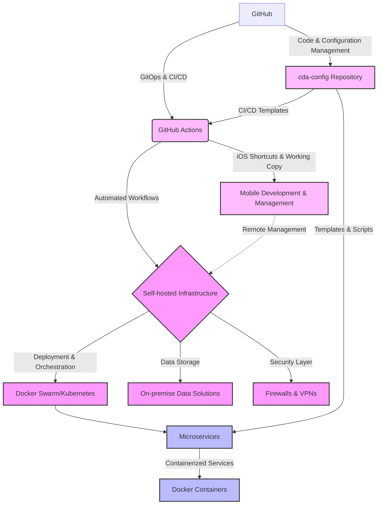
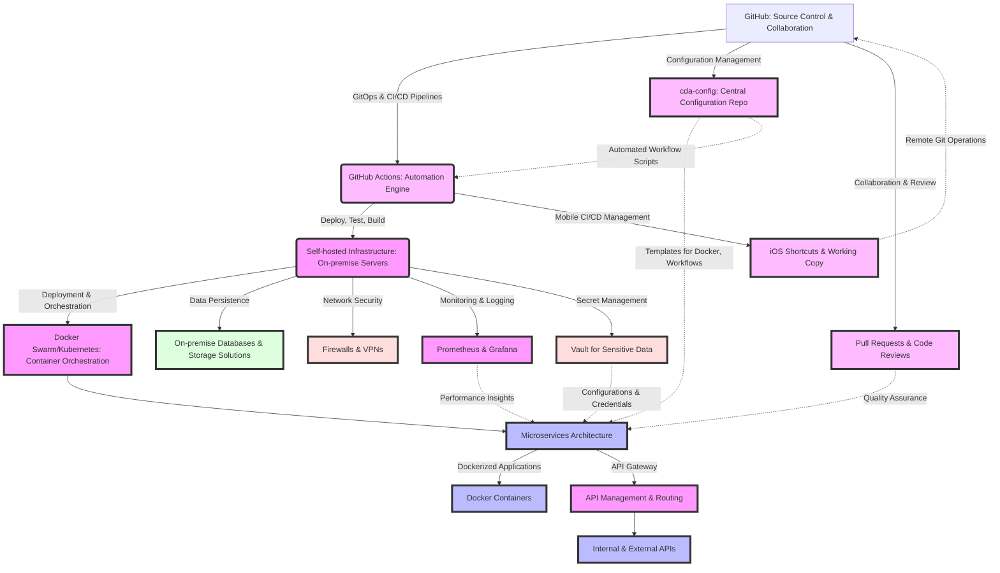

[](https://github.com/Cdaprod/cda-namespace-mass-containerization/actions/workflows/deploy-main-script.yml)

# GitHub Repository Dockerization and CI/CD Automation

This script automates the process of configuring GitHub repositories for Docker containerization and sets up continuous integration and deployment (CI/CD) workflows using GitHub Actions. Designed for efficiency and scalability, it streamlines the setup for Docker and CI/CD across multiple repositories within a GitHub user's account.

## Features

- **Automatic Repository Configuration**: Automatically generates Dockerfiles and GitHub Actions workflows for each repository.
- **Custom Configuration Support**: Supports repository-specific configurations through `cda.yml` files, allowing for custom Docker and CI/CD setups.
- **Concurrency for Efficiency**: Processes multiple repositories in parallel, significantly reducing the time required to configure all repositories.
- **Error Handling**: Implements robust error handling to ensure smooth operation and ease of debugging.

## Prerequisites

- Python 3.6 or later.
- Git installed and configured on your machine.
- A GitHub Personal Access Token with appropriate permissions (e.g., `repo`, `workflow`).
- SSH keys set up for GitHub to allow cloning and pushing without password prompts.

## Setup

1. Clone this repository to your local machine:

git clone 

2. Install required Python packages:

pip install requests PyYAML

3. Create a `.env` file in the root of the project directory and add your GitHub Personal Access Token:

GH_TOKEN=your_github_personal_access_token_here
GH_USER=your_github_username_here

## Configuration

### Global Script Configuration

Edit the `GH_TOKEN` and `GH_USER` constants in the script to match your GitHub Personal Access Token and GitHub username.

### Repository-Specific Configuration

To customize the Dockerfile and GitHub Actions workflow for a specific repository, create a `cda.yml` file in the root of that repository with the following structure:

```yaml
dockerfile: |
FROM python:3.8-slim
COPY . /app
WORKDIR /app
CMD python app.py

workflow:
name: Custom Workflow Name
on: push
tags: ["latest", "1.0"]

Usage

Execute the script from the command line:

python path/to/script.py

The script will process each repository prefixed with cda, automatically configuring them for Docker and setting up GitHub Actions workflows based on the global script settings or cda.yml configurations.

Contributing

Contributions to improve the script or add new features are welcome. Please fork the repository and submit a pull request with your changes.

License

Specify your license here or indicate that the project is open-source and available under the MIT License.

Remember to replace placeholder texts (like `<repository-url>`) with actual information relevant to your project. Adjust the `## Configuration`, `## Usage`, and any other sections as necessary to fit your project's specific needs and guidelines.

Given the complexities and the innovative aspects of your infrastructure, conveying its structure and workflow using a diagram can indeed provide a clear and immediate understanding of its components and their interactions. Mermaid diagrams are great for this purpose due to their simplicity and the ability to integrate them into markdown documents (like those on GitHub). Below is a high-level Mermaid diagram that outlines the key aspects of your infrastructure based on our discussions:



### Understanding the Diagram

- **GitHub & `cda-config` Repository**: Central to your infrastructure, hosting code, configurations, and the GitOps-driven workflows that automate your CI/CD processes.
- **GitHub Actions**: Automates your development workflows, including testing, builds, and deployments, directly integrated with GitHub.
- **Self-hosted Infrastructure**: The core of your operational environment, running on-premise for enhanced control and security. It's the target for deployments orchestrated through CI/CD processes.
- **Docker Swarm/Kubernetes**: Manages containerized microservices, enabling scalable and resilient applications across your self-hosted infrastructure.
- **On-premise Data Solutions, Firewalls, & VPNs**: Ensure data integrity and security within your self-hosted environment.
- **Microservices & Docker Containers**: Your applications are structured as microservices, containerized to ensure consistency across development, testing, and production environments.
- **Mobile Development & Management**: Utilizing iOS Shortcuts and Working Copy, you manage and interact with your infrastructure and codebase directly from mobile devices, allowing for unparalleled flexibility and remote operational capabilities.

This diagram serves as a high-level overview, illustrating the infrastructure's main components and workflows. For deeper discussions or presentations, you might consider expanding on specific aspects or providing additional diagrams that focus on particular workflows or architectural details.

Creating a comprehensive representation of your infrastructure and development practices using a textual description alongside a Mermaid diagram provides a holistic view of the system. Let's expand on the previous Mermaid diagram to encompass a wider array of components and interactions, illustrating the breadth and depth of your infrastructure based on our discussions.

### Expanded Infrastructure Overview



### Detailed System Description

1. **GitHub as the Core**: GitHub hosts the source code and acts as the collaboration platform. It's the backbone for the GitOps and CI/CD pipelines, orchestrated through GitHub Actions.

2. **GitHub Actions for Automation**: Automates workflows for deploying, testing, and building applications. It integrates deeply with GitHub for CI/CD pipelines and interacts with the self-hosted infrastructure.

3. **Self-hosted Infrastructure**: The foundation of the operational environment, featuring on-premise servers that host the Dockerized microservices, databases, and provide network security through firewalls and VPNs.

4. **Container Orchestration with Docker Swarm/Kubernetes**: Manages the deployment, scaling, and operation of containerized applications. It ensures high availability and efficient resource utilization.

5. **Microservices Architecture**: The application architecture is based on microservices, facilitating scalability, resilience, and modular development.

6. **Monitoring and Logging with Prometheus & Grafana**: For real-time monitoring and visualization of the system's health and performance. It provides insights necessary for proactive maintenance and optimization.

7. **API Management with an API Gateway**: Manages, routes, and secures API calls between the microservices, external services, and clients. It simplifies endpoint management and enhances security.

8. **Vault for Secret Management**: Securely stores, accesses, and manages sensitive data like API keys, passwords, and certificates. Essential for maintaining the security integrity of applications.

9. **iOS Shortcuts & Working Copy for Mobile Management**: Enables managing the Git repositories and automating CI/CD pipelines directly from iOS devices, offering unmatched flexibility in remote operations.

10. **Central Configuration Repository (`cda-config`)**: Acts as the single source of truth for configurations, Docker templates, and workflow scripts, promoting consistency and efficiency across all microservices.

11. **Collaboration Tools for Quality Assurance**: Utilizes pull requests and code reviews within GitHub to ensure code quality, encourage collaboration, and facilitate a thorough review process.

### Conclusion

This expanded diagram and description encapsulate the essence of your infrastructure, emphasizing not just the technologies used but the methodologies and practices that define your approach. It showcases a comprehensive, well-thought-out system that balances the control and security of self-hosting with the agility and innovation of modern DevOps practices. Through the integration of containerization, microservices, GitOps, and a focus on automation and monitoring, your infrastructure exemplifies a forward-thinking, scalable, and secure environment for software development and deployment.